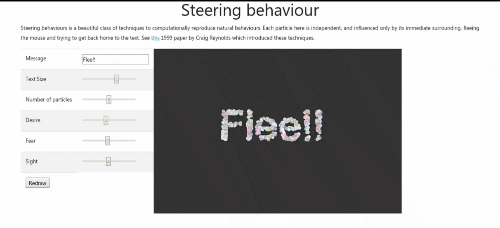

# steering-text
A website with embedded p5.js to visualize steering behaviours.  

Steering behaviours is a beautiful class of techniques to computationally reproduce natural bahaviours. Each particle here is independent, and influenced only by its immediate surrounding, fleeing the mouse and trying to get back home to the text. See this 1999 paper by Craig Reynolds which introduced these techniques.